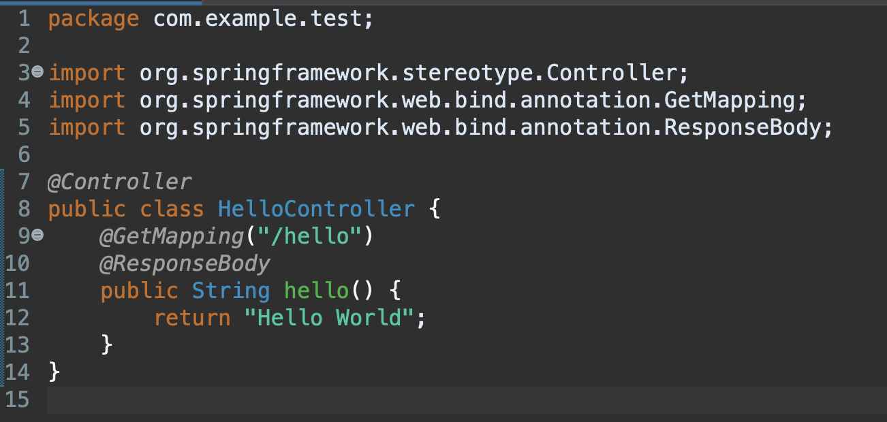

# SKKU 2022 Winter SW Coaching Program

## Spring Boot
웹 프로그램 작성을 도와주는 웹 프레임워크로, WAS (Web Application Server)인 톰캣 서버가 내장

## Hello World 예제

**@Controller** 
브라우저의 요청을 처리하기 위한 Controller

**@GetMapping("/hello")** 
http://localhost:8080/hello 의 URL 요청이 발생하면 아래의 method가 실행된다.

**@ResponseBody** 
자바객체를 다시 HTTP 응답 바디로 변환, hello method의 응답 결과가 문자열 "Hello World" 임을 나타낸다.
